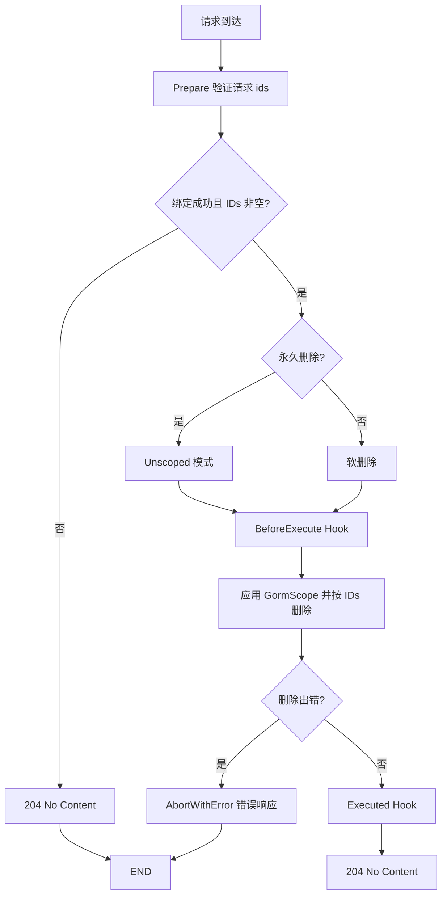

# 批量删除

::: warning 提示
当前方法不提供项目级简化。
:::

一般情况下，使用下面的方法即可软删除记录，
如果请求的查询参数中携带 `permanent=true` 参数，那么就会彻底删除记录。
```go
type batchDeleteStruct[T] struct {
   IDs     []string `json:"ids"`
}

func BatchDestroy(c *gin.Context) {
    core := cosy.Core[model.User](c).BatchDestroy()
}
```
如果默认情况下就想彻底删除记录，请使用下面的方法：

```go
func BatchDestroy(c *gin.Context) {
    cosy.Core[model.User](c).PermanentlyBatchDelete()
}
```

如果执行成功，将会响应 StatusCode = 204，body 为空。

## 生命周期

1. **BeforeExecute** (Hook)
2. **GormScope** (Hook)
3. 执行删除操作
4. **Executed** (Hook)



在这个功能中，我们提供了三个钩子，分别是 `BeforeExecuteHook`，`GormScope` 和 `ExecutedHook`。

你可以在 `BeforeExecuteHook` 中设置删除条件，

也可以在 `GormScope` 中限制 SQL 查询条件来阻止越权的删除操作。

## BatchEffectedIDs
前端传递的 ID 列表，可以在 BeforeExecuteHook 和 ExecutedHook 中使用。

```go
ctx.BatchEffectedIDs []uint64
```
