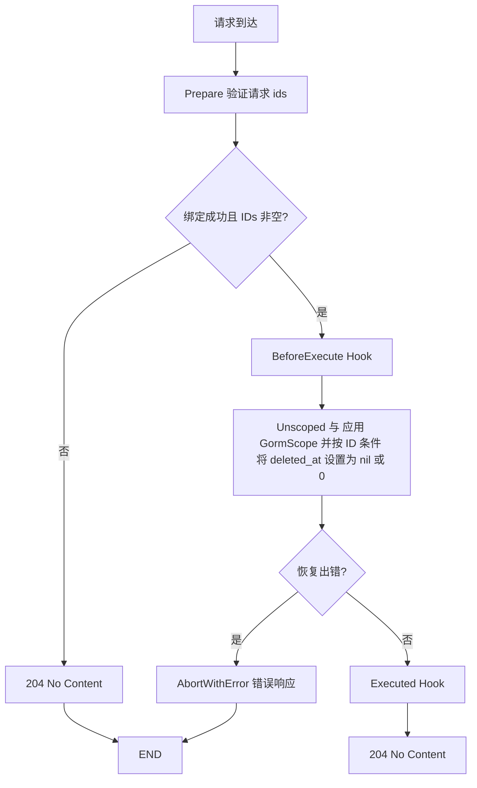

# 批量恢复

批量恢复功能允许同时恢复多个被软删除的记录。

## 基本用法

```go
package api

import (
    "github.com/gin-gonic/gin"
    "github.com/uozi-tech/cosy"
    "github.com/uozi-tech/cosy/model"
)

func BatchRecoverUser(c *gin.Context) {
    core := cosy.Core[model.User](c)
    core.BatchRecover()
}
```

## 请求格式

批量恢复接口接受以下请求格式：

### 通过 ID 数组恢复
```json
{
  "ids": [1, 2, 3, 4, 5]
}
```

### 通过自定义主键列
可以通过 `SetItemKey("uuid")` 修改用于 SQL 条件的列名（例如从 `id` 改为 `uuid`）。
注意：请求体的字段名始终为 `ids`，不会因列名变化而改变。

```go
func BatchRecoverUser(c *gin.Context) {
    cosy.Core[model.User](c).
        SetItemKey("uuid").
        BatchRecover()
}
```

## 生命周期

批量恢复操作的生命周期如下：

1. 解析请求体中的 ID 数组
2. **BeforeExecuteHook** - 执行前钩子
3. 批量恢复数据库记录（将 `deleted_at` 设置为 NULL）
4. **ExecutedHook** - 执行后钩子
5. 返回恢复的记录 ID 列表



## 钩子函数

### BeforeExecuteHook
在批量恢复操作执行前调用，可以用于权限检查、日志记录等：

```go
func logBatchRecover(ctx *cosy.Ctx[model.User]) {
    ids := ctx.BatchEffectedIDs
    ctx.Logger.Info("准备批量恢复用户", "ids", ids)
}

func BatchRecoverUser(c *gin.Context) {
    core := cosy.Core[model.User](c)
    core.BeforeExecuteHook(logBatchRecover).BatchRecover()
}
```

### ExecutedHook
在批量恢复操作完成后调用，可以用于触发后续业务逻辑：

```go
func afterBatchRecover(ctx *cosy.Ctx[model.User]) {
    ids := ctx.BatchEffectedIDs
    // 可以在这里触发其他业务逻辑，比如发送通知
    sendRecoverNotification(ids)
}

func BatchRecoverUser(c *gin.Context) {
    core := cosy.Core[model.User](c)
    core.ExecutedHook(afterBatchRecover).BatchRecover()
}
```

## 事务支持

批量恢复操作支持事务，确保操作的原子性：

```go
func BatchRecoverUser(c *gin.Context) {
    core := cosy.Core[model.User](c).WithTransaction()

    core.BeforeExecuteHook(func(ctx *cosy.Ctx[model.User]) {
        // 在事务中执行其他相关操作
        for _, id := range ctx.BatchEffectedIDs {
            userLog := model.UserLog{
                UserID: cast.ToUint64(id),
                Action: "recovered",
                Time:   time.Now(),
            }
            ctx.Tx.Create(&userLog)
        }
    }).BatchRecover()
}
```

## 响应状态

成功时返回 **204 No Content**，响应体为空。

## 权限控制

结合钩子函数可以实现细粒度的权限控制：

```go
func checkRecoverPermission(ctx *cosy.Ctx[model.User]) {
    currentUser := ctx.GetCurrentUser() // 假设有获取当前用户的方法

    if !currentUser.HasPermission("user.batch_recover") {
        ctx.AbortWithError(errors.New("没有批量恢复权限"))
        return
    }

    // 检查是否只能恢复自己创建的用户
    if currentUser.Role != "admin" {
        var validIDs []string
        for _, id := range ctx.BatchEffectedIDs {
            var user model.User
            err := ctx.DB.Unscoped().Where("id = ? AND created_by = ?", id, currentUser.ID).First(&user).Error
            if err == nil {
                validIDs = append(validIDs, id)
            }
        }
        ctx.BatchEffectedIDs = validIDs
    }
}
```

## 路由注册

```go
func initUserRoutes(r *gin.RouterGroup) {
    userGroup := r.Group("/users")
    {
        // 批量恢复（示例自定义路由）
        userGroup.PATCH("/batch", BatchRecoverUser)
    }
}
```

## 生命周期

1. **BeforeExecute** (Hook)
2. **GormScope** (Hook)
3. 执行恢复操作
4. **Executed** (Hook)


在这个功能中，我们提供了三个钩子，分别是 `BeforeExecuteHook`，`GormScope` 和 `ExecutedHook`。

你可以在 `BeforeExecuteHook` 中设置恢复条件，

也可以在 `GormScope` 中限制 SQL 查询条件来阻止越权的恢复操作。

## BatchEffectedIDs
前端传递的 ID 列表，可以在 BeforeExecuteHook 和 ExecutedHook 中使用。

```go
ctx.BatchEffectedIDs []uint64
```
