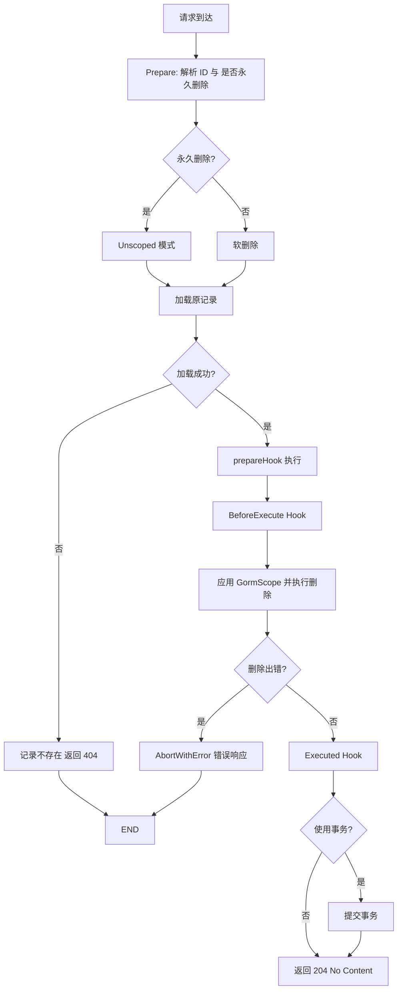

# 删除

::: warning 提示
路由规则中应包含 `:id` 参数，如 `/user/:id`。
:::

一般情况下，使用下面的方法即可软删除记录，
如果请求的查询参数中携带 `permanent=true` 参数，那么就会彻底删除记录。

```go
func DestroyUser(c *gin.Context) {
    cosy.Core[model.User](c).Destroy()
}
```

如果默认情况下就想彻底删除记录，请使用下面的方法：

```go
func DestroyUser(c *gin.Context) {
    cosy.Core[model.User](c).PermanentlyDelete()
}
```

如果执行成功，将会响应 StatusCode = 204，body 为空。

## 生命周期

1. **BeforeExecute** (Hook)
2. **GormScope** (Hook)
3. 查询原记录
4. 执行删除操作
5. **Executed** (Hook)



在这个功能中，我们提供了三个钩子，分别是 `BeforeExecuteHook`，`GormScope` 和 `ExecutedHook`。

你可以在 `BeforeExecuteHook` 中设置删除条件，

也可以在 `GormScope` 中限制 SQL 查询条件来阻止越权的删除操作，

在 `ExecutedHook` 中，`ctx.OriginModel` 是原记录，可以执行其他操作，比如发送邮件，记录日志等。
