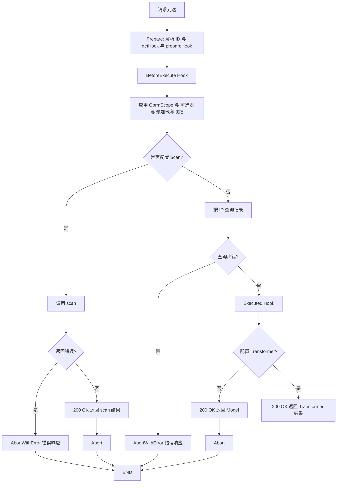

# 单个记录

在 Gin Handler Func 中，使用 `cosy.Core[类型](c)` 初始化一个 Core 对象

```go
func GetUser(c *gin.Context) {
    cosy.Core[model.User](c).Get()
}
```

上面的代码中，`c` 是来自 Gin Handler Func 的 `*Context`，`model.User` 是我们定义的一个 Gorm 模型。

::: warning 提示
路由规则中应包含 `:id` 参数，如 `/user/:id`。
:::

在 Controller 中只需要一行代码，即可实现获取单个记录的接口。

## 预加载
使用链式方法来设置查询条件，例如可以 Preload 这个用户的用户组
```go
func GetUser(c *gin.Context) {
    cosy.Core[model.User](c).SetPreloads("User").Get()
}
```

## 表名称
使用 `SetTable(table string)` 方法来设置表名，通常用于 SQL View 查询。
```go
func GetUser(c *gin.Context) {
    cosy.Core[model.User](c).SetTable("user_view").Preload("User").Get()
}
```

## GormScope
Cosy 提供了 `GormScope(fx func(tx *gorm.DB) *gorm.DB)` 方法，可以在执行数据库查询时调用 Gorm 的方法。

```go
func GetUser(c *gin.Context) {
   cosy.Core[model.User](c).
   SetTable("user_view").
   GormScope(func(tx *gorm.DB) *gorm.DB {
        return tx.Where("status", 1)
   }).
   Preload("Group").
   Get()
}
```

## Transformer
Cosy 提供了 `SetTransformer(fx func(user *model.User) any)` 方法，可以在返回响应之前对数据进行处理。

```go
type APIUser struct {
   model.User
   GroupName string `json:"group_name"`
}

func GetUser(c *gin.Context) {
   cosy.Core[model.User](c).
      SetTransformer(func(user *model.User) any {
         var group string
         if user.Group != nil {
            group = user.Group.Name
         }
         return &APIUser{
            User:      *user,
            GroupName: group,
         }
      }).
      Preload("Group").
      Get()
}
```

## Scan
使用 SQL View 后或者其他情况需要扩展原有模型的字段，可以使用 `SetScan(fx func(tx *gorm.DB) any)` 方法，自定义扫描函数。
通过 tx 指针可以执行更加复杂的 SQL 操作，如 JOIN、Where 等。

```go
type UserView struct {
   model.User
   GroupName string `json:"group_name"`
}

func GetUser(c *gin.Context) {
   cosy.Core[model.User](c).
   SetScan(func (tx *gorm.DB) any{
      users := make([]UserView, 0)
      tx.Scan(&users)
      return users
   }).
   SetTable("user_view").
   Preload("Group").
   Get()
}
```

::: warning 注意
`setScan` 不能和 `setTransformer` 一起使用，若同时使用，将只执行 `setScan` 函数。
:::

## 生命周期

1. **BeforeExecute**
2. 执行获取操作
3. **Executed**
4. 返回响应



## 响应示例

::: tip 提示
`group` 使用的是指针，且 Json Tag 中加入 `omitempty` 参数，在返回响应时，如果它是空指针，就不会该字段。
:::

```json
{
  "id": 1,
  "name": "Jacky",
  "email": "me@jackyu.cn",
  "phone": "123456789",
  "avatar": "avatar.jpg",
  "last_active": "2024-01-01T00:00:00Z",
  "power": 1,
  "status": 1,
  "group_id": 1,
  "group": {
    "id": 1,
    "name": "Admin"
  },
  "group_name": "Admin"
}
```
