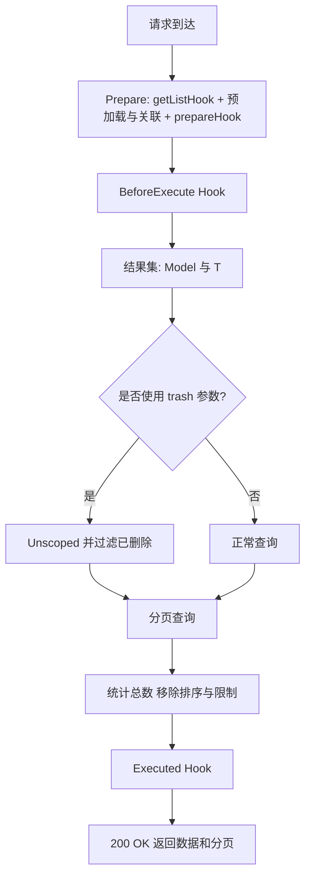

# 列表

```go
func GetList() {
   core := cosy.Core[model.User](c).
   SetFussy("name", "phone", "email").
   SetIn("status")

   core.PagingList()
}
```

## 生命周期

1. **BeforeExecute**
2. 执行获取操作
3. **Executed**
4. 返回响应



## 筛选方法

::: tip 提示
筛选方法可以被多次调用，本质上执行的是 slice 的 `append` 方法。
:::

1. SetFussy(keys ...string)
    - 设置模糊搜索, 使用 LIKE %...% 作为查询条件。
2. SetEqual(keys ...string)
    - 设置等于查询, 使用 = 作为查询条件。
3. SetIn(keys ...string)
    - 设置 IN 查询, 使用 IN 作为查询条件。
4. SetOrFussy(keys ...string)
    - 设置模糊搜索的 OR 查询, 使用 LIKE %...% 或者其他条件。
5. SetOrEqual(keys ...string)
    - 设置等于查询的 OR 查询, 使用 = 或者其他条件。
6. SetOrIn(keys ...string)
    - 设置 IN 查询的 OR 查询, 使用 IN 或者其他条件。
7. SetSearchFussyKeys(keys ...string)
    - 设置多个字段的模糊搜索，使用子查询 OR 连接。

## 排序和分页
Query 请求参数说明
- sort_by: 排序字段
- order: desc 倒序，asc 顺序
- page: 当前页数
- page_size: 每页数量

:::: tip 提示
如需同时查看已软删除的数据，可在查询参数中加入 `trash=true`。
::::

## 非分页列表
当数据量较小或需要一次性返回全部数据时，可使用 `List()`：

```go
func GetAllUsers(c *gin.Context) {
   cosy.Core[model.User](c).
      SetFussy("name", "phone").
      SetIn("status").
      List()
}
```

返回为纯数组，未包含分页信息。

## 空分页响应
当需要返回一个空的分页结构（例如首次加载或无数据时），可使用 `EmptyPagingList()`：

```go
func GetEmpty(c *gin.Context) {
   cosy.Core[model.User](c).EmptyPagingList()
}
```

返回示例：

```json
{
  "data": [],
  "pagination": {
    "per_page": 10
  }
}
```

## 标准选择器初始化
当请求中包含 `id[]` 参数时，列表会优先按这些 ID 过滤，常用于「标准选择器」初始化：

```
GET /users?page=1&id[]=1&id[]=2&id[]=3
```

::: tip 提示
为了避免数据库注入，只有 Struct 定义了的字段才可以排序，如果你使用了 SQL View 扩展了字段，
可以调用 `AddColWhiteList(cols ...string)` 方法，将这些字段加入白名单。
:::

如果您需要使用自己的逻辑进行排序，请使用 `func WithoutSortOrder() *Ctx[T]` 方法禁用默认的排序逻辑。

## 其他方法

以下方法的使用与获取**单个记录**的方式相同

- SetTable(table string)
- SetTransformer(fx func(user *model.User) any)
- SetScan(fx func(tx *gorm.DB) any)
- GormScope(fx func(tx *gorm.DB) *gorm.DB)

## 响应示例

```json
{
  "data": [
    {
      "id": 1,
      "name": "Jacky",
      "email": "me@jackyu.cn",
      "phone": "123456789",
      "avatar": "avatar.jpg",
      "last_active": "2024-01-01T00:00:00Z",
      "power": 1,
      "status": 1,
      "group_id": 1,
      "group": {
        "id": 1,
        "name": "Admin"
      },
      "group_name": "Admin"
    }
  ],
  "pagination": {
    "total": 1,
    "per_page": 10,
    "current_page": 1,
    "total_pages": 1
  }
}
```
