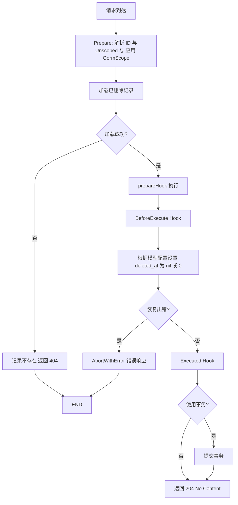

# 恢复（对于软删除）

::: warning 提示
路由规则中应包含 `:id` 参数，如 `/user/:id`。
:::

```go
func DestroyUser(c *gin.Context) {
    cosy.Core[model.User](c).Recover()
}
```

## 生命周期

1. **BeforeExecute** (Hook)
2. **GormScope** (Hook)
3. 查询原记录
4. 执行删除操作
5. **Executed** (Hook)



如果执行成功，将会响应 StatusCode = 204，body 为空。

在这个功能中，我们提供了三个钩子，分别是 `BeforeExecuteHook`，`GormScope` 和 `ExecutedHook`。

你可以在 `BeforeExecuteHook` 中设置恢复的条件

也可以在 `GormScope` 中限制 SQL 查询条件来阻止越权的恢复操作

在 `ExecutedHook` 中，`ctx.Model` 是恢复的记录，你可以执行其他操作，比如发送邮件，记录日志等。
